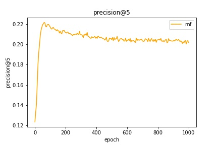
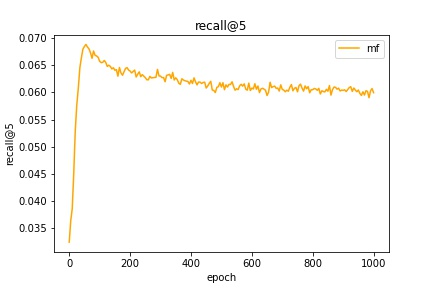
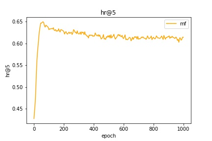
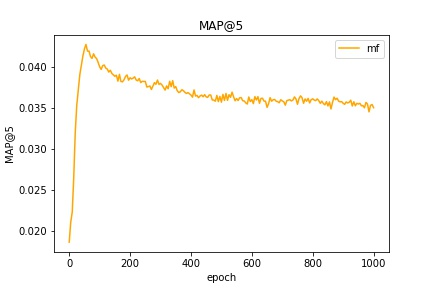

在movielens-1m和amzon-book两个数据集上跑最基本的BPRMF算法。

movielens-1m上的实验结果：

    

**更新：**

把之前实现的版本都放入了version 1文件夹之中，之前实现的版本可扩展性太低，在此基础上实现其他模型，会造成大量的代码冗余，对我造成了很多麻烦。把整个model模型拆成两个类，代码扩展性会高很多。

1. model模块，参数有embedding_size, l2_embedding等模型参数，主要功能是输出loss
2. trainer模块，参数有epoch，earlystop，verbose等训练时相关的参数，主要的功能是一个训练器


**更新 6.2**
原先使用python多进程加速(不能使用多线程，因为python中的多线程是伪多线程)，现在额外再trainer中加入了c++ eval的test_cpp函数，速度比python多进程快了10倍。

注意：第一次使用时，要编译cpp

```
python setup.py build_ext --inplace
```

